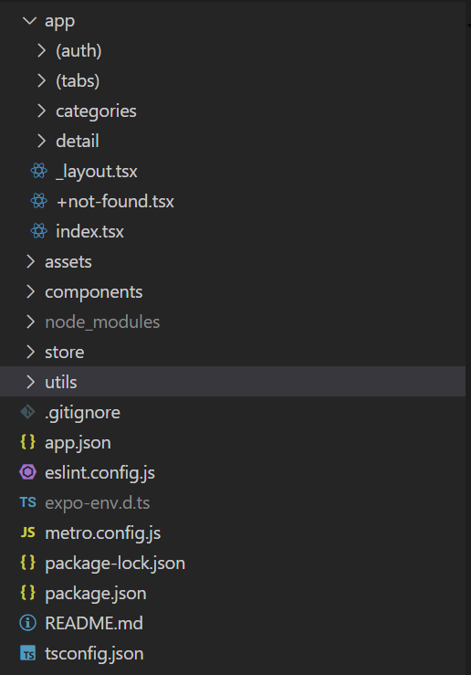
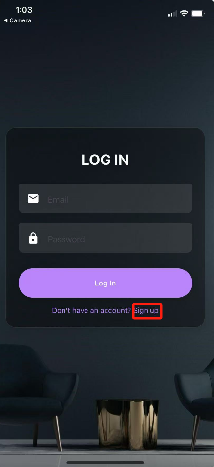
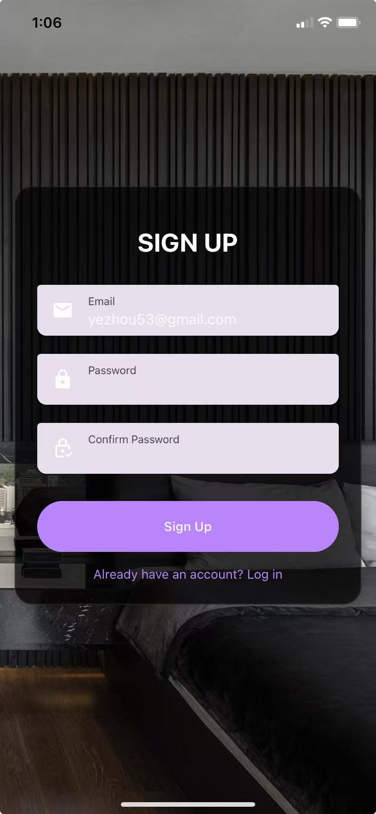
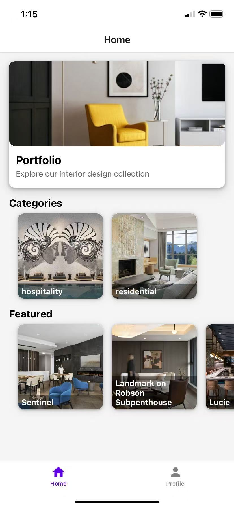
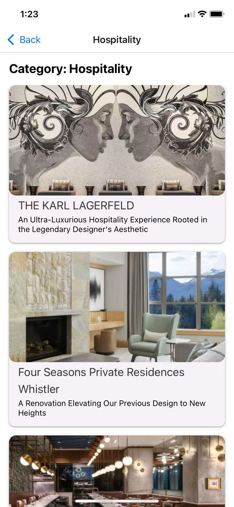
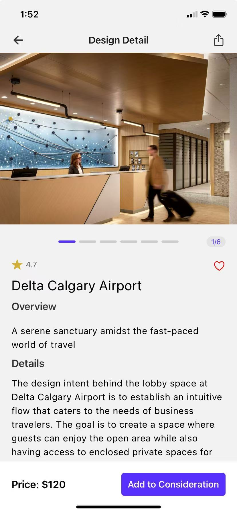
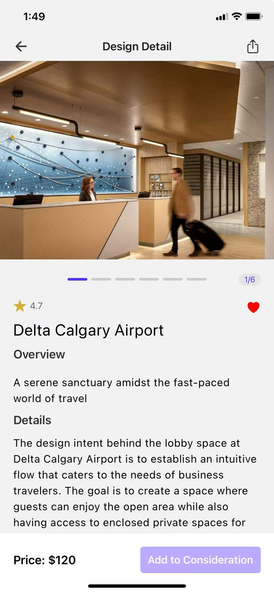
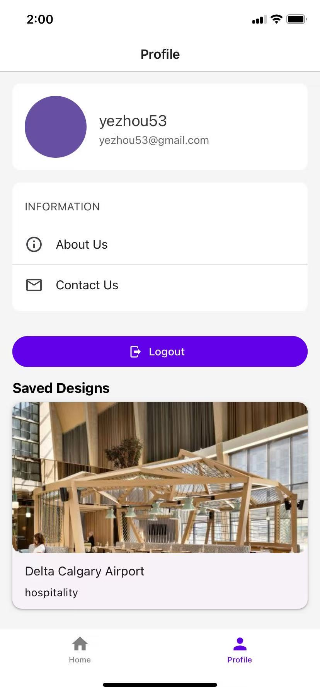

# Interior Design Portfolio

This is a portfolio app that is able to display various interior design informations. Users can click into any of the design to get the detail of that design and interact with the app by adding one design to favourite.

## 1. Project Structure

Overall structure:

Source code files:

> app
>
> > (auth)
> >
> > > login.tsx
> > >
> > > signup.tsx
> >
> > (tabs)
> >
> > > _layout.tsx
> > >
> > > design_list.tsx
> > >
> > > index.tsx
> > >
> > > profile.tsx
> >
> > categories
> >
> > > [name].tsx
> >
> > detail
> >
> > > [id].tsx
> >
> > _layout.tsx
> >
> > +not-found.tsx
> >
> > index.tsx
>
> components
>
> > ImageSlider.tsx
> >
> > Pagination.tsx
>
> store
>
> > useStore.tsx
>
> utils
>
> > database.tsx

Text Editor: VS Code

platform: Android, IOS, Web

## 2. Module Components

- `app`: stores the source code of various app pages in the porfolio app. There are different module pages, such as authentication, categories and detail pages
- `components`: stores the react native components that are used by any of the pages in `app`
- `store`: implementation of global context store of the porfolio app. This is used to maintain global state across app pages.
- `utils`: store the functions that can manipulate sqlite from the app.

## 3. Key features

### 1. User Authentication

1. Before you log in, you need to sign up:

   

2. Sign up with your email & customized password:

   

3. After clicking the signup, the user will navigate back to the login page and be prompted to type their emails & password to log in.

### 2. Home Page

This page is used to display various designs. User can either jump to the detail page of a particular design or go to the gallery page of designs under a category

### 3. Category page

display category page of a particular category in home page:

### 4. Detail Page

display the detail page of a particular design. Users can swipe the picture on the top and view the description:

Users can also add the design to their favourite by clicking the heart button or add to consideration and remove the design from favourite by clicking the heart button again.

Users can share the app page link to others by clicking the right top button. The recipients may paste the link in their browsers and jump to the app page while their app is launching

### 5. Profile Page

## 4. Set up & run

1. Install latest stable version of node

2. Unzip the folder and open the interior-design as the root folder in the text editor

3. run `npm install` in command line

4. run `npx expo start` and there will be a QR code in the command line

   

5. Install Expo Go from App store in your iphone
6. Scan the QR code using your camera and you will be led to the app page in Expo Go

## 5. Github link

https://github.com/xiongshenping/interior-portfolio
